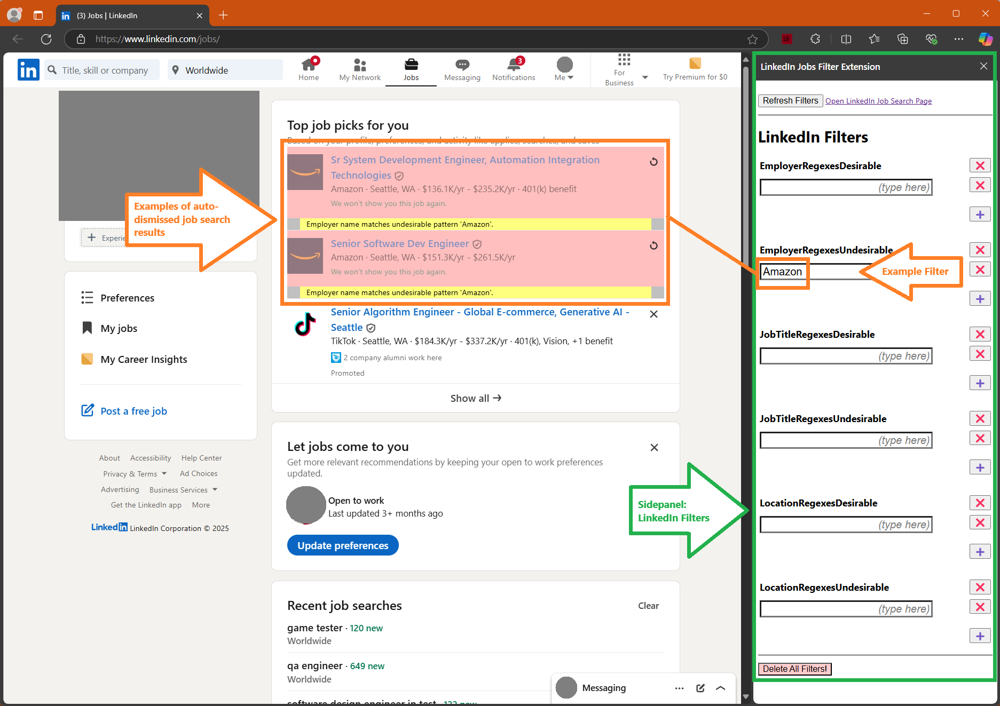
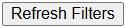
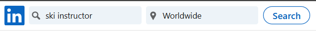
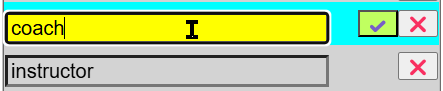
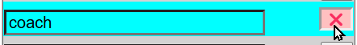

# LinkedIn Jobs Filter Extension

This extension automatically dismisses LinkedIn job search results based on your
criteria:

* Employer names
* Job titles
* Job locations

# Getting Started

## Open the Filter Editor

1. "⁝" or "..." menu > Extensions
   * 
   * 
2. Pin extension icon to toolbar
   * 
   * 
3. Click extension icon to open its sidepanel
   * 
   * 


## Tour the Filter Editor

### What will the browser look like?

The Filter Editor is designed to appear alongside your LinkedIn job search
results page and remain open while you navigate them.

You can open and close the sidepanel at any time by clicking the extension's
icon.  To make this convenient, consider pinning the extension's icon to your
browser's toolbar.

What's going on in the screenshot below?

* The LinkedIn job search results page is visible on the left.
* The Filter Editor is visible in the sidepanel on the right.
* On the left, the two Amazon jobs in the "Top job picks for you"
  section are shown with a reddish background color because they
  were automatically dismissed by a job filter.
* On the right, the word "Amazon" appears under the Undesirable
  Employer heading.  This is the filter that caused the two Amazon
  jobs to be automatically dismissed by this extension.

Screenshot:



### What's in the Filter Editor?

* Refresh button
  * 
  * This button lives at the top of the Filter Editor.
  * Press this button to sync your filters with changes that you might have
    made in other instances of this browser on this computer or on other
    computers.

* "Open LinkedIn Job Search Page" link
  * 
  * This link is next to the Refresh button.
  * Click this link to open https://www.linkedin.com/jobs/
    in a browser tab.
    It's a convenient way to begin or resume your job search.

* Three pairs of filter categories.
  * Employer Names.
  * Job Titles.
  * Job Locations.


## Your First Filter

Here's a scenario that you've probably run into -- it's a scenario
that this extension was designed specifically to address:

<details>

<summary>
LinkedIn shows you results that you're likely to dismiss, no matter how
carefully you define your job search criteria.
</summary>

> You're scrolling or paging through the job search results.
  Some are relevant and interesting, and some are not.  Some
  you're qualified for, and some you're not.
>
> Normally, you can click that little "x" (dismiss) button in the
  top-right corner of a search result to ask LinkedIn not to show
  you that job anymore.
>
> 
>
> The more you search, the more you run into these jobs you won't
  or can't apply to.  Clicking the dismiss button becomes a chore.
  You start to notice patterns among the jobs you quickly dismiss:
>
> * Certain employers don't offer any jobs that are interesting to you.
>   * Example: They're contract agencies but you're looking for full-time work.
> * Certain job titles are not interesting to you.
>   * Example: You're a software tester, but are seeing IT or
>     software programmer jobs.
> * There are locations that you're not willing to commute or
    relocate to.
>
> You can try to fight LinkedIn's search criteria, but it's easier
  to broaden your job search than narrow it down.
>
> So instead, this extension lets you describe what you're _not_
  looking for, and will _automatically_ dismiss those job search
  results for you.

</details>

### Example scenario:  Searching for "ski instructor" shows unrelated job titles

Examples I've seen:

* Certified Personal Trainer
* Swim Team Coach (Seasonal)
* Group Fitness Instructor


#### Scenario Outline

1. Become familiar with the Filter Editor.
1. Search for "ski instructor" jobs.
1. Identify job results that don't belong.
1. Create filters that auto-dismiss the results that don't belong.
1. Revise your filters as necessary.

#### Steps

1. Become familiar with the Filter Editor.

   <details>
   <summary>
   Your LinkedIn Filters sidepanel will look something like the following
   (click to expand).
   </summary>
   
   ```
   [Refresh Filters button]  Open LinkedIn Job Search Page link
   ---
   
   Desired Employer Names
   [    (type here)] [✔️] [❌]
   
   Undesired Employer Names
   [    (type here)] [✔️] [❌]
   
   Desired Job Titles
   [    (type here)] [✔️] [❌]
   
   Undesired Job Titles
   [    (type here)] [✔️] [❌]
   
   Desired Locations
   [    (type here)] [✔️] [❌]
   
   Undesired Locations
   [    (type here)] [✔️] [❌]
   
   ---
   [Delete All Filters!]
   ```
   </details>

2. Search for "ski instructor" jobs.

   * In the LinkedIn page, begin a search for "ski instructor".
   

3. Review the search results for ski instructor.

   * If you're lucky, you'll find a job title that exactly match
     "ski instructor", but chances are there are many job titl
     related to athletic coaches and personal trainer

4. Create filters that auto-dismiss the results that don't belong.

   1. Define a filter that will protect your desired job title.
      This is necessary to prevent overly ambitous filters from
      accidentally dismissing your desired jobs.

      1. In the Filter Editor (the sidepanel), look for the heading
         "Desirable Job Titles".
      1. Under that heading, click in the text box that contains
         "(type here)".
      1. Type "ski instructor" into that text box
         without the quotation marks.
      1. Press the "✔️" button to confirm that filter.

   1. Define a filter that will auto-dismiss the jobs whose titles
      are clearly unrelated, such as "personal trainer".

      1. In the Filter Editor, look for the heading
         "Undesirable Job Titles".
      1. Under that heading, click in the text box that contains
         "(type here)".
      1. Into that text box, type one of the undesirable job titles.
         My examples include the following, but your results might be different:
         * "instructor"
         * "swim coach"
         * "fitness specialist"
      1. Press the "✔️" button to confirm that filter.

   <details>
   <summary>
   Shortly after creating your filters, the LinkedIn job search results page
   should automatically update, causing the jobs whose titles match the
   Undesirable Job Title phrases to be dismissed while preserving the jobs that
   match your Desirable Job Title(s).
   
   (Click for example screenshot.)
   </summary>
   
   
   </details>
   
   > [!Warning]
   > 
   > Why use "ski instructor" as a Desirable filter,
     but use "instructor" as an Undesirable filter?
     Won't that auto-dismiss all "ski instructor" jobs?
   > 
   > While "ski instructor" contains the Undesirable job title
     "instructor", the Desirable Job Title "ski instructor" filter
     also matches and will overrule the Undesirable Job Title.
   >
   > [!Tip]
   >
   > The general tip is: within a category (e.g. Employer Name,
     Job Title, or Location), any Desirable filter will overrule
     all Undesirable filters.


5. Revise your filters as necessary.

   We've filtered out a lot of job results irrelevant to
   ski instruction, but there are more of them.
   
   You can add more filters or remove them whenever needed.
   
   * Add a filter.
   
     To add a new filter under any heading, press the green "➕" button next to
     the empty row.  This will create a new empty text box for you to type into.
   
     
   
     Then type your new filter.
   
     
   
   * Remove a filter.
   
     To delete an existing filter, press the "❌" button to its right.
   
     
   
     > [!WARNING]
     >
     > Note that any job that has already been dismissed will remain
       dismissed, even if you delete the filter that caused it to be
       dismissed.
     >
     > If you want to rescue an auto-dismissed job, you must manually
       press the
       
       button _before_ closing, refreshing, reloading, or navigating away
       from the search results page where the dismissed job is displayed.


# How the Extension Works


## How the Extension Looks at LinkedIn Job Search Results

Each LinkedIn job search result generally looks like this:

```
[company icon]   -----*job title*---------------  [x]
                 *company name*
                 *job location (remote)*
                 pay rate
                 your connections who work here
                 viewed • promoted • Easy Apply
```

Out of all of this information, this extension only pays attention to the
*job title*, *company name*, and *job location* (which helpfully happens to
include the "on-site", "remote", and "hybrid" parenthetical note).

This extension helps you automatically click that [x] button to tell LinkedIn
to never show you that job again if it contains an undesirable job title,
company name, or job location that you specify.


## How Filtering Works


### In Summary

1. The extension waits until the job results page has stopped updating.
1. It looks at the list of job results one by one, skipping any that have
   already been dismissed.
1. For each of the remaining job results, it compares the employer name,
      job title, and job location against your Desirable and Undesirable
      filters to decide whether or not to automatically dismiss the job.

> [!NOTE]
> 
> <details>
> <summary>
> Note that "Dismissing a job result" is exactly the same as pressing that
  little "x" button in the top-right corner of the job result.  It asks
  LinkedIn to not show you that search result ever again.
> 
> (Click for screenshot.)
> </summary>
> 
> 
> </details>
> 
> You can manually undo this by pressing the 
> circle-with-counterclockwise-arrow
> 
> button before you refresh or close the page.


### In Detail

1. The extension waits until the job results page has stopped updating.
   * The page could be changing because the page is still loading.
   * The page could be changing because you scrolled more results into view.
   * The page could be changing because you navigated to another page of results.
1. It looks at the list of job results one by one, skipping any that have
   already been dismissed.
   1. It first checks the employer name.
      * Does the employer name match any _undesirable_ job name filter you
        specified?
      * Does the employer name match any _desirable_ job name filter you
        specified?
      * If any _desirable_ employer name filter matches, that will overrule
        all _undesirable_ employer name filters.
        * For example,
          if your Undesirable Employer Name filters are "Agency" and "Staffing",
          but your Desirable Employer Name filters include "Acme",
          then an employer named "Acme Staffing Agency" will _not_ be
          automatically dismissed.
   1. It then checks the job title against your Desirable Job Title and
      Undesirable Job Title filters.
   1. It then checks the job location against your Desirable Location and
      Undesirable Location filters.
   1. If _any_ of these checks identifies an undesirable job, then the job will
      be dismissed.
      * For example, if a job has a desirable employer name, a desirable job
        title, but an undesirable location, then the job will be dismissed.


# Troubleshooting

* In a pinch, delete all of your filters by scrolling to the bottom of the
  sidepanel and pressing the "Delete All Filters!" button, then re-adding one
  filter at a time.
* Try pressing the "Refresh Filters" button if your filters changed from some
  other browser instance.
* Try refreshing the LinkedIn jobs page.
* Try returning to https://www.linkedin.com/jobs/.
* Try reloading the extension.
